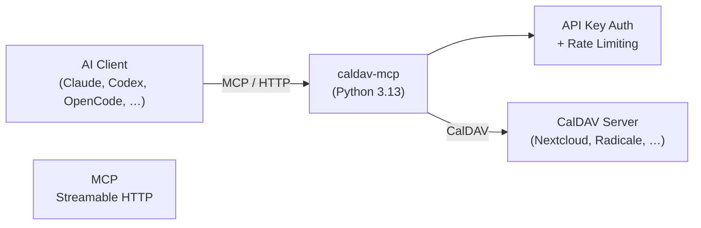

# caldav-mcp

**Give AI assistants full read/write access to any CalDAV calendar.**

An MCP server that connects Model Context Protocol clients — Claude, Codex,
OpenCode, Cursor, and others — to CalDAV-compatible calendar servers. Query
events, create meetings, manage attendees, and move events between calendars,
all through a single Docker container with no database and no external
dependencies.

[](LICENSE)
[](https://www.python.org)
[](Dockerfile)
[](https://modelcontextprotocol.io)
[](https://github.com/gelse/caldav-mcp/actions)

## What it does

caldav-mcp gives your AI assistant direct access to your calendar. Instead of
copy-pasting events or switching tabs, ask your assistant to do it:

- **"What's on my calendar tomorrow?"** → [`caldav_get_today_events`](caldav_mcp/tools/queries.py)
- **"Find my next dentist appointment."** → [`caldav_search_events`](caldav_mcp/tools/queries.py)
- **"Create a meeting next Tuesday at 14:00."** → [`caldav_create_event`](caldav_mcp/tools/mutations.py)
- **"Move this event to my personal calendar."** → [`caldav_move_event`](caldav_mcp/tools/mutations.py)
- **"When am I free next week?"** → [`caldav_get_freebusy`](caldav_mcp/tools/queries.py)
- **"Add Alice and Bob to this event."** → [`caldav_add_attendee`](caldav_mcp/tools/attendees.py)
- **"Delete the duplicate appointment."** → [`caldav_delete_event`](caldav_mcp/tools/mutations.py)

## Why caldav-mcp

| | |
|---|---|
| **Provider-agnostic** | Works with any RFC 4791 CalDAV server — Nextcloud, Radicale, Baikal, ownCloud, iCloud, Fastmail, and others. No provider-specific API. |
| **Full read/write** | 14 focused tools covering calendar discovery, event queries, creation, updates, deletion, moves, and attendee management. |
| **Stateless** | No session state between requests. Credentials travel per-request in HTTP headers, so a single server instance can serve multiple CalDAV accounts. |
| **Single container** | One Docker image, one `docker compose up`. No database, no background workers, no sidecars, no external SaaS. |
| **Security built in** | Optional API-key authentication with constant-time comparison, per-IP rate limiting, input sanitization, and structured audit logging. |
| **Self-hosted** | Runs anywhere Docker runs. Keep your calendar data on your own infrastructure. |

## Supported CalDAV servers

| Provider / Server | Status |
| --- | --- |
| [Radicale](https://radicale.org/) | Integration-tested (CI pipeline) |
| [Nextcloud](https://nextcloud.com/) | Known to work (used in development) |
| [Baikal](https://github.com/sabre-io/Baikal) | Protocol-compatible |
| [ownCloud](https://owncloud.com/) | Protocol-compatible |
| [iCloud](https://www.icloud.com/) | Protocol-compatible |
| [Fastmail](https://www.fastmail.com/) | Protocol-compatible |
| Other RFC 4791 CalDAV servers | Protocol-compatible |

Any server that implements the [CalDAV standard (RFC 4791)](https://datatracker.ietf.org/doc/html/rfc4791)
should work. If it doesn't, [open an issue](https://github.com/gelse/caldav-mcp/issues).

## Quick start

### 1. Clone and configure

```bash
git clone https://github.com/gelse/caldav-mcp.git
cd caldav-mcp
cp .env.example .env
```

Edit `.env` with your CalDAV credentials:

```env
CALDAV_URL=https://cloud.example.com/remote.php/dav/calendars/user/
CALDAV_USERNAME=user
CALDAV_PASSWORD=app-password
CALDAV_MCP_API_KEY=your-secret-token
TZ=Europe/Vienna
```

### 2. Start the server

```bash
docker compose up -d
```

The server is now running at `http://localhost:8600/mcp` (Streamable HTTP).

### 3. Verify

```bash
curl -s http://localhost:8600/mcp \
  -H "Authorization: Bearer your-secret-token" \
  -H "X-Caldav-Url: https://cloud.example.com/remote.php/dav/calendars/user/" \
  -H "X-Caldav-Username: user" \
  -H "X-Caldav-Password: app-password" \
  -d '{"jsonrpc":"2.0","id":1,"method":"initialize","params":{"protocolVersion":"2024-11-05","capabilities":{},"clientInfo":{"name":"test","version":"1"}}}'
```

## MCP client configuration

The server exposes a Streamable HTTP endpoint at `/mcp`. Any MCP client that
supports Streamable HTTP transport can connect.

### Generic endpoint

```
http://localhost:8600/mcp
```

### Claude Desktop / Claude Code

Add to your MCP settings:

```json
{
  "mcpServers": {
    "caldav": {
      "url": "http://localhost:8600/mcp",
      "headers": {
        "Authorization": "Bearer YOUR_API_KEY",
        "X-Caldav-Url": "https://cloud.example.com/remote.php/dav/calendars/user/",
        "X-Caldav-Username": "user",
        "X-Caldav-Password": "app-password"
      }
    }
  }
}
```

### OpenCode / Cursor / VS Code

Any MCP client that supports Streamable HTTP can use the same endpoint. Set
the URL to `http://localhost:8600/mcp` and pass the required headers
(`Authorization`, `X-Caldav-Url`, `X-Caldav-Username`, `X-Caldav-Password`)
in the client's MCP server configuration.

### Multiple CalDAV accounts

Because credentials travel per-request in HTTP headers, a single server
instance can serve multiple CalDAV accounts. Configure each MCP client
connection with different `X-Caldav-*` headers.

## Tools

The server exposes 14 MCP tools across three categories.

### Calendar & queries

| Tool | Description |
| --- | --- |
| [`caldav_list_calendars`](caldav_mcp/tools/queries.py) | List all available calendars for the configured account |
| [`caldav_get_events`](caldav_mcp/tools/queries.py) | Get events in a date range |
| [`caldav_get_today_events`](caldav_mcp/tools/queries.py) | Get events for today |
| [`caldav_get_week_events`](caldav_mcp/tools/queries.py) | Get events for the next 7 days |
| [`caldav_get_event_by_uid`](caldav_mcp/tools/queries.py) | Get a specific event by UID, including attendees |
| [`caldav_search_events`](caldav_mcp/tools/queries.py) | Find events by text across summary, description, location, and categories |
| [`caldav_get_freebusy`](caldav_mcp/tools/queries.py) | Get free/busy information for a time range |

### Event management

| Tool | Description |
| --- | --- |
| [`caldav_create_event`](caldav_mcp/tools/mutations.py) | Create a new event — supports recurring rules, priority, categories, and attendees |
| [`caldav_update_event`](caldav_mcp/tools/mutations.py) | Partially update an existing event by UID |
| [`caldav_delete_event`](caldav_mcp/tools/mutations.py) | Delete an event by UID |
| [`caldav_move_event`](caldav_mcp/tools/mutations.py) | Move an event between calendars |

### Attendees

| Tool | Description |
| --- | --- |
| [`caldav_add_attendee`](caldav_mcp/tools/attendees.py) | Add an attendee to an event |
| [`caldav_remove_attendee`](caldav_mcp/tools/attendees.py) | Remove an attendee from an event |
| [`caldav_list_attendees`](caldav_mcp/tools/attendees.py) | List attendees of an event |

Full API documentation: [`docs/api.md`](docs/api.md).

## Architecture



Two authentication layers sit between the client and the CalDAV server:

1. **MCP endpoint auth** — optional API key via `Authorization: Bearer` or
   `X-Api-Key` header. Protects the MCP endpoint itself.
2. **CalDAV credentials** — `X-Caldav-Url`, `X-Caldav-Username`,
   `X-Caldav-Password` headers (or environment variables). Authenticate
   against the CalDAV server.

The server is **stateless** — no database, no session store. The only
in-memory state is a thread-safe LRU cache of CalDAV client connections.

## Security

### Authentication

**MCP endpoint auth** (`CALDAV_MCP_API_KEY`):

- Every request to `/mcp` must include `Authorization: Bearer <token>` or
  `X-Api-Key: <token>`.
- Token comparison uses constant-time comparison to prevent timing attacks.
- **When `CALDAV_MCP_API_KEY` is unset, the endpoint is open. Do not expose
  it to the public internet without authentication.**

**CalDAV credentials** are resolved per-request:

1. HTTP headers (preferred): `X-Caldav-Url`, `X-Caldav-Username`,
   `X-Caldav-Password`
2. Environment variables (fallback): `CALDAV_URL`, `CALDAV_USERNAME`,
   `CALDAV_PASSWORD`

### TLS

- **Option A**: Enable built-in TLS by setting `CALDAV_MCP_TLS_CERT` and
  `CALDAV_MCP_TLS_KEY`. The server listens on HTTPS directly.
- **Option B**: Run behind a TLS-terminating reverse proxy (Traefik, Caddy,
  nginx).

Without TLS, all traffic — including API keys and CalDAV passwords — is
transmitted in plaintext.

### Rate limiting

Failed authentication attempts are tracked per client IP using a sliding-window
rate limiter with exponential backoff. Defaults: 10 failures per 60-second
window. Configurable via `CALDAV_MCP_RATE_LIMIT_MAX_FAILURES` and
`CALDAV_MCP_RATE_LIMIT_WINDOW_SECONDS`.

### Audit logging

All authentication attempts and tool operations are logged. Set
`CALDAV_MCP_LOG_FORMAT=json` for structured JSON output suitable for log
aggregation systems.

### Deployment recommendations

- Bind to `127.0.0.1` or a private network unless you need remote access.
- Restrict access at the network/firewall layer to trusted hosts or a VPN.
- Never commit CalDAV app passwords to version control.
- Use a reverse proxy for TLS termination in production.

## Configuration

All configuration is via environment variables, validated at startup with
Pydantic.

### Server

| Variable | Default | Description |
| --- | --- | --- |
| `CALDAV_MCP_PORT` | `8080` | Listen port (inside container) |
| `CALDAV_MCP_PATH` | `/mcp` | Streamable HTTP endpoint path |
| `CALDAV_MCP_API_KEY` | `""` (disabled) | Shared secret for MCP endpoint auth |
| `TZ` | `""` (UTC) | IANA timezone (e.g. `Europe/Vienna`) for today/week boundaries |

### CalDAV

| Variable | Default | Description |
| --- | --- | --- |
| `CALDAV_URL` | `""` | CalDAV server URL (fallback for `X-Caldav-Url` header) |
| `CALDAV_USERNAME` | `""` | CalDAV username (fallback for `X-Caldav-Username` header) |
| `CALDAV_PASSWORD` | `""` | CalDAV password (fallback for `X-Caldav-Password` header) |
| `CALDAV_MCP_CALDAV_VERIFY_SSL` | `true` | Verify TLS certs on CalDAV connections. Set `false` only for testing with self-signed certs. |

### TLS

| Variable | Default | Description |
| --- | --- | --- |
| `CALDAV_MCP_TLS_CERT` | `""` | Path to TLS certificate PEM file |
| `CALDAV_MCP_TLS_KEY` | `""` | Path to TLS private key PEM file |
| `CALDAV_MCP_TLS_CA_BUNDLE` | `""` | Optional CA bundle for custom certificate authorities |

### Rate limiting

| Variable | Default | Description |
| --- | --- | --- |
| `CALDAV_MCP_RATE_LIMIT_MAX_FAILURES` | `10` | Max failed auth attempts per IP within the sliding window |
| `CALDAV_MCP_RATE_LIMIT_WINDOW_SECONDS` | `60` | Sliding window duration in seconds |

### Logging

| Variable | Default | Description |
| --- | --- | --- |
| `CALDAV_MCP_LOG_FORMAT` | `text` | Audit log format: `text` or `json` |

## Deployment

### Local / private Docker deployment

The recommended approach for personal use:

```bash
docker compose up -d
```

The server runs on `localhost:8600` and is not accessible from the network
unless you explicitly publish the port to a specific interface.

### Behind a reverse proxy

For multi-user or internet-facing deployments, put the server behind a
reverse proxy (Traefik, Caddy, nginx) that handles TLS termination and
access control:

```nginx
server {
    listen 443 ssl;
    server_name caldav-mcp.example.com;

    ssl_certificate     /etc/ssl/certs/caldav-mcp.pem;
    ssl_certificate_key /etc/ssl/private/caldav-mcp-key.pem;

    location /mcp {
        proxy_pass http://127.0.0.1:8600/mcp;
        proxy_set_header Host $host;
        proxy_set_header X-Real-IP $remote_addr;
        proxy_set_header X-Forwarded-For $proxy_add_x_forwarded_for;
        proxy_set_header X-Forwarded-Proto $scheme;
    }
}
```

### Built-in TLS

If you prefer not to use a reverse proxy, enable built-in TLS:

```bash
CALDAV_MCP_TLS_CERT=/path/to/cert.pem \
CALDAV_MCP_TLS_KEY=/path/to/key.pem \
docker compose up -d
```

## Compatibility / limitations

- **Streamable HTTP only** — the server uses MCP Streamable HTTP transport.
  There is no stdio transport. To use stdio, modify [`server.py`](server.py)
  to call `mcp.run()` instead of `mcp.run_http_async()`.
- **Search is client-side** — `caldav_search_events` fetches all events and
  filters locally. This works well for small to medium calendars. Very large
  calendars may experience slower search.
- **Move is non-atomic** — `caldav_move_event` copies the event to the target
  calendar with a new UID, then deletes the original. A failure after copy
  leaves a duplicate (the safer failure mode).
- **No published Docker image** — the CI pipeline builds and tests the image
  but does not publish it. Build locally with `docker build -t caldav-mcp .`
  or use `docker compose up --build`.
- **No GitHub releases yet** — the project is at version `0.1.0`.

## Development

### Setup

```bash
python3 -m venv .venv
source .venv/bin/activate
pip install -r requirements.txt
pip install -e ".[dev]"
cp .env.example .env  # configure your CalDAV credentials
```

### Commands

```bash
make test              # Run unit tests
make test-integration  # Run integration tests (requires docker-compose.test.yaml)
make test-performance  # Run performance benchmarks
make lint              # Lint with ruff (check + format)
make typecheck         # Type check with mypy
make check             # All checks: lint + typecheck + deps-check + test
make deps-check        # Verify pyproject.toml and requirements.txt are in sync
make build             # Build Docker image
```

### Project structure

```
caldav-mcp/
├── server.py                 # Thin entrypoint, launches FastMCP HTTP server
├── caldav_mcp/               # Core package
│   ├── tools/                # MCP tool handlers
│   │   ├── queries.py        #   Read-only tools (7)
│   │   ├── mutations.py      #   Write tools (4)
│   │   └── attendees.py      #   Attendee management (3)
│   ├── auth.py               # Two-layer auth (API key + CalDAV creds)
│   ├── calendar.py           # CalDAV calendar selection & serialization
│   ├── client_cache.py       # Thread-safe LRU cache for DAVClient
│   ├── config.py             # Env var parsing, header constants
│   ├── config_schema.py      # Pydantic startup validation
│   ├── datetime_utils.py     # Date/time parsing, timezone helpers
│   ├── errors.py             # Typed exceptions, ToolResult dataclass
│   ├── event_builder.py      # Pure iCalendar VEVENT construction
│   ├── sanitizers.py         # Input sanitization, field length limits
│   ├── rate_limit.py         # Sliding-window rate limiter
│   ├── audit.py              # Structured JSON audit logging
│   ├── constants.py          # Shared string constants
│   └── types.py              # CalDAVClient Protocol definition
├── tests/                    # Unit, integration, performance
├── docs/                     # Architecture, API, contributing docs
├── Dockerfile                # Multi-stage Docker build
├── docker-compose.yaml       # Production compose
├── docker-compose.test.yaml  # Test compose with Radicale
├── requirements.txt          # Runtime dependencies (pinned)
├── pyproject.toml            # Dev config and dependencies
└── Makefile                  # Build/test shortcuts
```

### Dependencies

| Package | Version | Purpose |
| --- | --- | --- |
| [`fastmcp`](https://github.com/jlowin/fastmcp) | 3.4.7 | MCP server framework, Streamable HTTP transport |
| [`caldav`](https://github.com/tobixen/python-caldav) | 3.2.1 | CalDAV client library |
| [`icalendar`](https://github.com/collective/icalendar) | 7.2.2 | iCalendar RFC 5545 parsing/generation |
| [`requests`](https://pypi.org/project/requests/) | >=2.28.0 | HTTP transport layer |

## Troubleshooting

| Symptom | Cause | Fix |
| --- | --- | --- |
| `Connection refused` | CalDAV server unreachable | Verify `CALDAV_URL` is correct and the server is running |
| `SSL: CERTIFICATE_VERIFY_FAILED` | Self-signed or invalid TLS cert | Import the server's CA into the system trust store, or set `CALDAV_MCP_CALDAV_VERIFY_SSL=false` for testing |
| `ERROR:[auth] unauthorized` | Missing or invalid API token | Set `CALDAV_MCP_API_KEY` and include `Authorization: Bearer <token>` in your request |
| `Missing CalDAV credentials` | No CalDAV headers or env vars | Provide `X-Caldav-*` headers or set `CALDAV_URL`/`CALDAV_USERNAME`/`CALDAV_PASSWORD` |
| `Calendar 'X' not found` | Typo or wrong calendar name | Run `caldav_list_calendars` to see available names — they are case-sensitive |
| Events show wrong time | Server timezone not set | Set the `TZ` env var to your IANA timezone (e.g. `Europe/Vienna`) |

## Contributing

See [`docs/contributing.md`](docs/contributing.md) for development setup, code
style, and architecture rules.

## License

[MIT](LICENSE)
