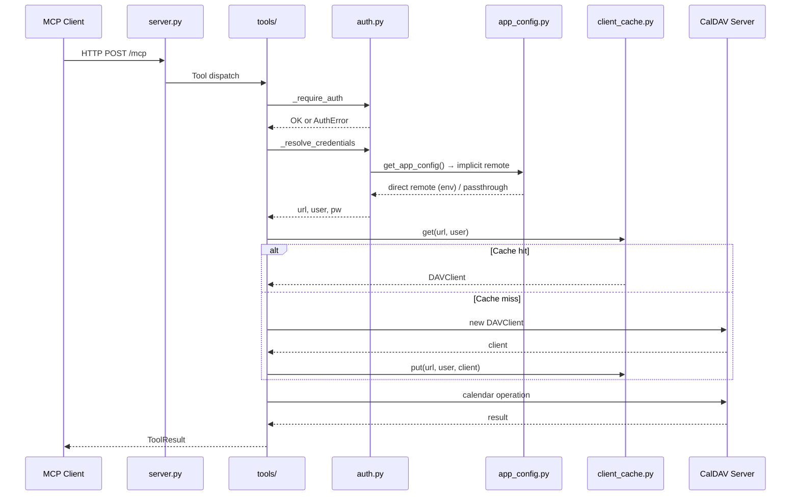

# Architecture

## Overview

caldav-mcp is a Model Context Protocol server that provides read/write access to CalDAV calendars. It uses the FastMCP framework with Streamable HTTP transport.

## Package Structure

| Module | Responsibility |
|--------|----------------|
| `server.py` | Thin entrypoint — re-exports all symbols, provides `main()` |
| `caldav_mcp/__init__.py` | Shared `FastMCP` instance, re-exports for backward compat |
| `caldav_mcp/app_config.py` | Read-only startup config singleton (`Config`/`Remote`/`Calendar`), env-derived built-in config, header-mode passthrough |
| `caldav_mcp/config.py` | Environment parsing, timezone resolution |
| `caldav_mcp/errors.py` | Typed exceptions, `ToolResult` dataclass, logging |
| `caldav_mcp/auth.py` | API token validation, CalDAV credential resolution |
| `caldav_mcp/datetime_utils.py` | Date/time parsing, formatting, timezone helpers |
| `caldav_mcp/calendar.py` | CalDAV calendar selection, event serialization |
| `caldav_mcp/client_cache.py` | Thread-safe LRU cache for `DAVClient` instances |
| `caldav_mcp/constants.py` | Shared string constants (error messages, defaults) |
| `caldav_mcp/types.py` | Type aliases (`CalDAVClient`) |
| `caldav_mcp/event_builder.py` | iCalendar event construction helpers |
| `caldav_mcp/tools/__init__.py` | Shared `with_caldav_client` decorator, `mcp_tool_if_writable` helper, result helpers, re-exports |
| `caldav_mcp/tools/queries.py` | Read-only calendar/event query tool handlers |
| `caldav_mcp/tools/mutations.py` | Event create/update/delete/move tool handlers |
| `caldav_mcp/tools/attendees.py` | Attendee management tool handlers |

## Data Flow

## Key Design Decisions

### Circular Import Mitigation

The package has a known circular import chain:
`server.py` → `caldav_mcp/__init__.py` → submodules → `server.py`

This is resolved by having `server.py` be the **only** entry point. Tests patch `server.<name>` to intercept shared state. See Phase 1 of `plans/01-architecture-separation-of-concerns.md` for the full analysis.

### Client Cache Strategy

`ClientCache` reuses `DAVClient` instances keyed by `(url, username)`. The password is **never** used as a cache key. LRU eviction with configurable TTL prevents stale connections. Thread-safety is ensured via `threading.Lock`.

### Error Classification

All tool handlers return `ToolResult` with a typed `Status` enum. The `_render_error` function classifies exceptions:
- `AuthError` → `Status.AUTH`
- `NotFoundError` → `Status.NOT_FOUND`
- Everything else → `Status.ERROR` (logged server-side, details not leaked)

### Tool Handler Organization

Tool handlers are split across submodules by responsibility:
- **`tools/queries.py`** — read-only operations (list, get, search, freebusy)
- **`tools/mutations.py`** — write operations (create, update, delete, move)
- **`tools/attendees.py`** — attendee management (add, remove, list)

The `with_caldav_client` decorator in `tools/__init__.py` handles auth, client creation/caching, and error classification. The `mcp_tool_if_writable` helper conditionally applies `@mcp.tool()` only when `CALDAV_MCP_READ_ONLY` is falsy — in read-only mode write functions stay importable but are never registered on the FastMCP instance. All `@mcp.tool()` handlers are re-exported from `tools/__init__.py` for backward compatibility.

### Config Singleton

`caldav_mcp/app_config.py` provides a read-only config singleton that serves as the single source of CalDAV connection data. It is loaded once at startup via `configure_app_config(load_app_config())` in [`server.py:main()`](../server.py) (line 252) and is truly read-only after initialization — all dataclasses use `frozen=True` and collections are tuples. Config changes require a process restart; there is no hot reload.

Two modes mirror the M1 rule:

- **Env mode** — `CALDAV_URL` is set (non-empty after `.strip()`): a built-in `direct` remote is constructed from environment variables (`CALDAV_URL`, `CALDAV_USERNAME`, `CALDAV_PASSWORD`). Request headers (`X-Caldav-*`) are ignored entirely. `X-Caldav-Username` and `X-Caldav-Password` are reserved for a future passthrough mode.
- **Header mode** — `CALDAV_URL` is unset or whitespace-only: an implicit `passthrough` remote is used and all three `X-Caldav-*` headers are required per request.

The `Config` / `Remote` / `Calendar` dataclasses intentionally match the conceptual model described in [`ideas/db-config-enhancement.md`](../ideas/db-config-enhancement.md) so that a future DB loader (M4) can produce the same structure without downstream changes. In simple (env) mode the `calendars` tuple is typically empty — calendar discovery stays live against the CalDAV server.
