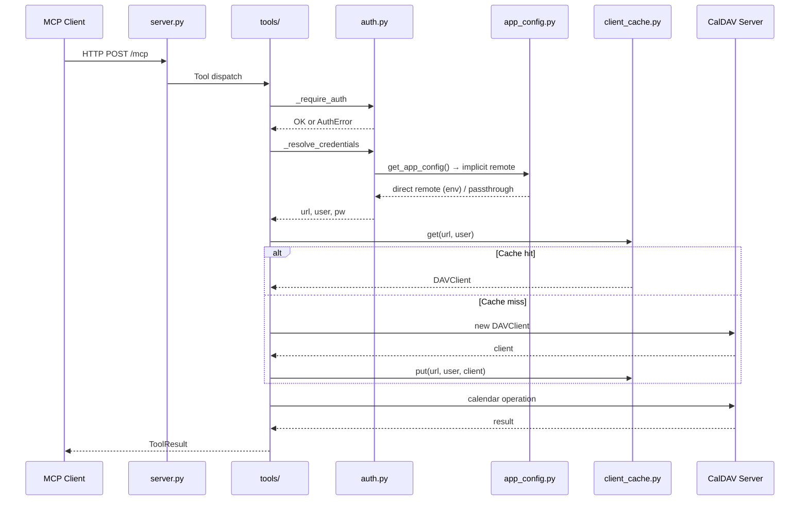

# Architecture

## Overview

caldav-mcp is a Model Context Protocol server that provides read/write access to CalDAV calendars. It uses the FastMCP framework with Streamable HTTP transport.

## Package Structure

| Module | Responsibility |
|--------|----------------|
| `server.py` | Thin entrypoint — re-exports all symbols, provides `main()` |
| `caldav_mcp/__init__.py` | Shared `FastMCP` instance, re-exports for backward compat |
| `caldav_mcp/app_config.py` | Read-only startup config singleton (`Config`/`Remote`/`Calendar`), env-derived built-in config, header-mode passthrough |
| `caldav_mcp/config.py` | Environment parsing, timezone resolution, header-name constants |
| `caldav_mcp/config_schema.py` | Pydantic startup validation for `ServerConfig` |
| `caldav_mcp/config_store.py` | SQLite-backed configuration store (pro mode building block) |
| `caldav_mcp/config_cli.py` | CLI for managing users, configs, remotes, and calendars in the store |
| `caldav_mcp/config_crypto.py` | Fernet encryption/decryption for stored CalDAV passwords |
| `caldav_mcp/db_loader.py` | Pro-mode DB loader — reads store, produces `AppConfig` + `ProUser` snapshot |
| `caldav_mcp/fanout.py` | Fan-out executor with per-remote aggregation and partial-failure reporting |
| `caldav_mcp/addressing.py` | Dotted-path (`config.remote.calendar`) parsing and access-filtered resolution |
| `caldav_mcp/key_hash.py` | PBKDF2-HMAC-SHA256 key hashing and verification |
| `caldav_mcp/errors.py` | Typed exceptions, `ToolResult` dataclass, logging |
| `caldav_mcp/auth.py` | API token validation, CalDAV credential resolution |
| `caldav_mcp/datetime_utils.py` | Date/time parsing, formatting, timezone helpers |
| `caldav_mcp/calendar.py` | CalDAV calendar selection, event serialization |
| `caldav_mcp/client_cache.py` | Thread-safe LRU cache for `DAVClient` instances |
| `caldav_mcp/constants.py` | Shared string constants (error messages, defaults) |
| `caldav_mcp/types.py` | Type aliases (`CalDAVClient`) |
| `caldav_mcp/event_builder.py` | iCalendar event construction helpers |
| `caldav_mcp/sanitizers.py` | Input sanitization, field length limits |
| `caldav_mcp/audit.py` | Structured JSON/text audit logging |
| `caldav_mcp/rate_limit.py` | Sliding-window rate limiter |
| `caldav_mcp/tools/__init__.py` | Shared `with_caldav_client` / `with_caldav_fanout` decorators, result helpers, re-exports |
| `caldav_mcp/tools/queries.py` | Read-only calendar/event query tool handlers |
| `caldav_mcp/tools/mutations.py` | Event create/update/delete/move tool handlers |
| `caldav_mcp/tools/attendees.py` | Attendee management tool handlers |

## Data Flow

## Key Design Decisions

### Circular Import Mitigation

The package has a known circular import chain:
`server.py` → `caldav_mcp/__init__.py` → submodules → `server.py`

This is resolved by having `server.py` be the **only** entry point. Tests patch `server.<name>` to intercept shared state. See Phase 1 of `plans/01-architecture-separation-of-concerns.md` for the full analysis.

### Client Cache Strategy

`ClientCache` reuses `DAVClient` instances keyed by `(url, username)`. The password is **never** used as a cache key. LRU eviction with configurable TTL prevents stale connections. Thread-safety is ensured via `threading.Lock`.

### Error Classification

All tool handlers return `ToolResult` with a typed `Status` enum. The `_render_error` function classifies exceptions:
- `AuthError` → `Status.AUTH`
- `NotFoundError` → `Status.NOT_FOUND`
- Everything else → `Status.ERROR` (logged server-side, details not leaked)

### Tool Handler Organization

Tool handlers are split across submodules by responsibility:
- **`tools/queries.py`** — read-only operations (list, get, search, freebusy)
- **`tools/mutations.py`** — write operations (create, update, delete, move)
- **`tools/attendees.py`** — attendee management (add, remove, list)

The `with_caldav_client` decorator in `tools/__init__.py` handles auth, client creation/caching, and error classification. The `mcp_tool_if_writable` helper conditionally applies `@mcp.tool()` only when `CALDAV_MCP_READ_ONLY` is falsy — in read-only mode write functions stay importable but are never registered on the FastMCP instance. All `@mcp.tool()` handlers are re-exported from `tools/__init__.py` for backward compatibility.

### Config Singleton

`caldav_mcp/app_config.py` provides a read-only config singleton that serves as the single source of CalDAV connection data. It is loaded once at startup and is truly read-only after initialization — all dataclasses use `frozen=True` and collections are tuples. Config changes require a process restart; there is no hot reload.

Three modes, encoding the M1 precedence rule as an architectural invariant:

- **Env mode** — `CALDAV_URL` is set (non-empty after `.strip()`): a built-in `direct` remote is constructed from environment variables (`CALDAV_URL`, `CALDAV_USERNAME`, `CALDAV_PASSWORD`). Request headers (`X-Caldav-*`) are ignored entirely. `X-Caldav-Username` and `X-Caldav-Password` are reserved for a future passthrough mode.
- **Header mode** — `CALDAV_URL` is unset or whitespace-only: an implicit `passthrough` remote is used and all three `X-Caldav-*` headers are required per request.
- **DB mode (pro)** — `DB_CONFIG_ENABLED=true`: the singleton is loaded from the SQLite store via [`db_loader.py`](../caldav_mcp/db_loader.py). Multiple named configs and remotes coexist. Direct remotes carry stored credentials; passthrough remotes use per-request `X-Caldav-*` headers.

**M1 precedence invariant:** When `CALDAV_URL` is set, environment credentials always win — `X-Caldav-*` request headers are ignored entirely. This is not per-field mixing: either all three values come from the environment, or all three come from request headers, or they come from the stored config. The config singleton encodes this rule at load time.

### Config store and CLI

[`caldav_mcp/config_store.py`](../caldav_mcp/config_store.py) implements a SQLite-backed store with a schema-versioned table layout. [`caldav_mcp/config_cli.py`](../caldav_mcp/config_cli.py) provides the `caldav-mcp-config` CLI for managing users, configs, remotes, and calendars. [`caldav_mcp/config_crypto.py`](../caldav_mcp/config_crypto.py) handles Fernet encryption of CalDAV passwords at rest (keyed by `CALDAV_MCP_CONFIG_SECRET`).

Store records map 1:1 onto the `Config` / `Remote` / `Calendar` dataclasses so that the DB loader produces the same singleton shape. The CLI encrypts passwords on write; the server decrypts on read in pro mode. `CALDAV_MCP_CONFIG_SECRET` must match between CLI and server. See [`docs/cli.md`](cli.md) for the full CLI reference.

### Startup flow

| Mode | Trigger | Startup sequence |
|------|---------|-----------------|
| Env | `CALDAV_URL` set | `load_app_config()` → `configure_app_config()` |
| Header | `CALDAV_URL` unset | `load_app_config()` → `configure_app_config()` (no implicit config) |
| DB (pro) | `DB_CONFIG_ENABLED=true` | `load_pro_state(db_path, secret)` → `configure_app_config(pro.app_config)` + `configure_pro_users(pro.users)` |

In env/header mode, [`server.py`](../server.py) calls `configure_app_config(load_app_config())`. In pro mode, it additionally calls `load_pro_state()` with the DB path and secret, then installs both the config singleton and the pro-user snapshot for auth.

### Pro mode

Pro mode (`DB_CONFIG_ENABLED=true`) loads configuration and users from the SQLite store at startup via [`caldav_mcp/db_loader.py`](../caldav_mcp/db_loader.py).

**Auth in pro mode:**

- `X-Mcp-Username` header identifies the user; `Authorization: Bearer <key>` or `X-Api-Key` provides the API key.
- Key verification uses PBKDF2-HMAC-SHA256 ([`caldav_mcp/key_hash.py`](../caldav_mcp/key_hash.py)).
- `CALDAV_MCP_API_KEY` is ignored — only DB-stored user credentials are accepted.
- Rate limiting applies per client IP as in simple mode.

### Fan-out execution model

Parameterless read tools (e.g. `caldav_list_calendars`, `caldav_get_events`) fan out across all accessible remotes via [`caldav_mcp/fanout.py`](../caldav_mcp/fanout.py).

**Execution model:**

- **Sequential** — remotes execute in config/remote declaration order (deterministic, no concurrency).
- **Per-remote aggregation** — each `(remote × calendar)` pair produces one `AggregatedEntry` with addressing fields (`config_name`, `remote_name`, `calendar_name`), the handler's `data` payload, an optional `error` string, and a per-entry `status`.

**Per-entry status vocabulary:**

| Status | Meaning |
|--------|---------|
| `ok` | Success — data returned |
| `empty` | Success — no matching data (zero results) |
| `auth` | `AuthError` — missing or invalid credentials |
| `not_found` | `NotFoundError` — calendar or event does not exist |
| `error` | Any other exception |

**Top-level status rule:**

- `Status.OK` when **at least one** scope succeeds (`ok` or `empty`).
- `Status.ERROR` when **all** scopes fail (`auth` / `error` / `not_found`).
- `Status.EMPTY` for zero accessible calendars.

One remote's failure **never** masks other remotes' results. The rendered message is built by `render_fanout_message` and lists one bracketed per-remote line in declaration order.

### Audit logging

The [`caldav_mcp/audit.py`](../caldav_mcp/audit.py) module logs authentication attempts and tool operations. The `log_operation` function accepts an optional `remotes` parameter — a `dict[str, str]` mapping `"config.remote"` to per-remote status strings — which is included as a `"remotes"` object in the JSON log entry when present. For non-fan-out calls the field is omitted (byte-identical to the pre-M5 shape).

### Dotted-path addressing

Write tools in pro mode require a `config.remote.calendar` dotted path (e.g. `main.radicale.work`) parsed by [`caldav_mcp/addressing.py`](../caldav_mcp/addressing.py). Plain calendar names are rejected with a typed error. For reads, an empty `calendar_name` fans out across all accessible calendars; a dotted path narrows to a single calendar. Config, remote, and calendar names must not contain dots (enforced by the store's charset regex `^[A-Za-z0-9][A-Za-z0-9_-]*$`).

**Mode table:**

| Mode | Config source | Auth | Write addressing |
|------|--------------|------|-----------------|
| Env | `CALDAV_URL` env var | `CALDAV_MCP_API_KEY` (optional) | Plain calendar name |
| Header | `X-Caldav-*` per request | `CALDAV_MCP_API_KEY` (optional) | Plain calendar name |
| DB (pro) | SQLite store at startup | DB users (`X-Mcp-Username` + key) | Dotted path required |
